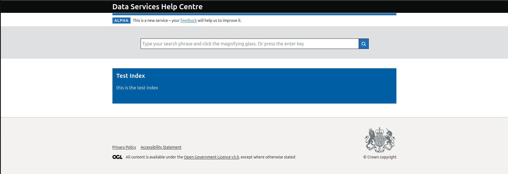
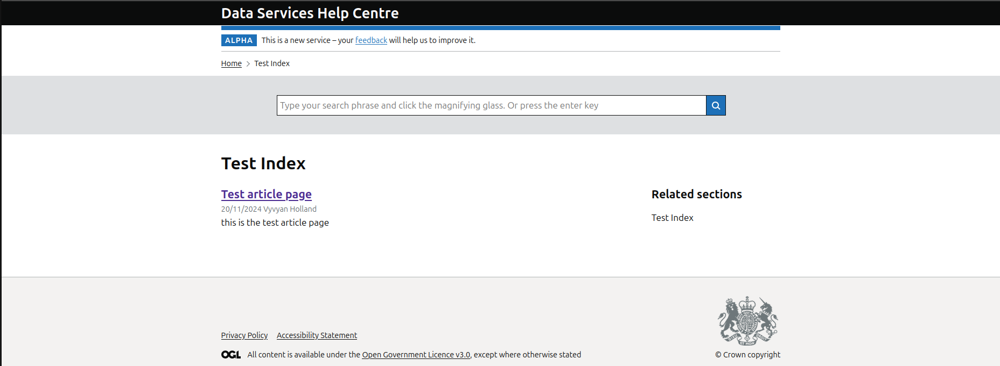
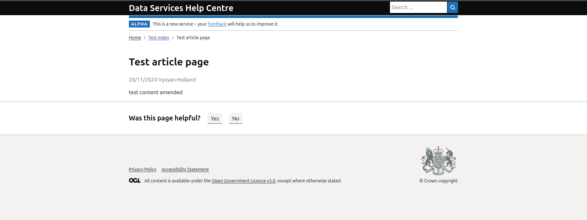
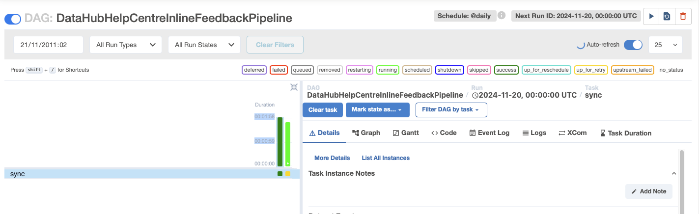

# Test suite

Documents manual testing against the new platform to ensure all business as usual activities can be performed.

## Helpcentre CMS Platform

### 1. Adding articles to HelpCentre
- Access the admin area of the CMS (Content Management Service) at `/admin`.
- Click the icon 'Page', this should take you to the page 'Home'.
- Click the plus icon at the top of the page (next to the title, 'Home'). It should have the tooltip, 'Add child page'.
- Click 'Article index page', fill out the fields and then click 'Publish' below (default is 'Save draft').

_Go to the home page and..._

**Check all fields entered in CMS are rendered** [x]
- In the `/admin` area, click on the article index page you have just created in 'Pages' (sidebar control).
- Click the elipsis icon (tooltip 'Actions') and select 'Add child page', then click 'Add article page'.
- Fill in the fields and click 'Publish'.

_Click the Article Index Page..._

**Check all fields entered in CMS are rendered** [x]

_Click the Article Page..._

**Check all fields entered in CMS are rendered** [x]

**Check this 'Was this page helpful?' widget renders** [x]

### 2. Modifying articles on HelpCentre
- Access the admin area.
- Find the article page you have created in `#1`.
- Amend the 'body' field and increment the 'sequence' field.

_Click the Article Page..._

**Check all fields entered in CMS are rendered** [x]

**Check this 'Was this page helpful?' widget renders** [x]

### 3. Checking article pages cannot be created from the Homepage
 - Access the admin area.

### 3. Deleting articles on HelpCentre
- Access the admin area.
- Find the article page you have created in `#1`.
- Select delete when clicking 'action'.
- Confirm deletion.

**Check the page no longer appears in the index** [x]

### 5. Feedback is submitted to Data-flow
- Go to an article page, and submit the feedback form by clicking 'Yes' at the heading 'Was this page helpful?', make sure to give a reason when prompted as 'Test'.
- Access Data-flow and find the DAG `DataHubHelpCentreInlineFeedbackPipeline`, there should be an input with the placeholder _Search DAGS_.
- There should be a 'Play' button in the right-hand corner to run the DAG, click this to manually run the DAG and consume the feedback data from the helpcentre.
- You should see a 'Success' run with a dark green bar in the left-hand side chart like the image below:

_Access data-flow having submitted feedback_

**Check that Data-flow can talk to helpcentre and that the DAG run is successful having submitted feedback** [x]

### 6. DataHub can access articles via API
- Get to `https://staging.datahub.uktrade.digital/`

_from the DataHub home page..._

**Check HelpCentre articles appear under the heading _What's new?_** [x]
